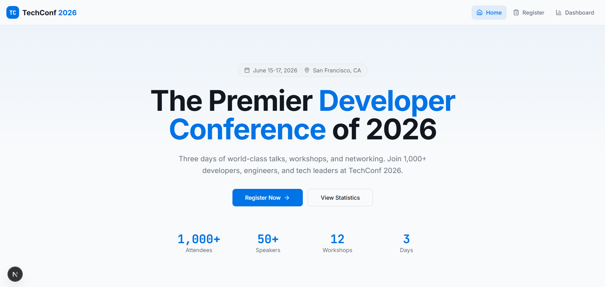
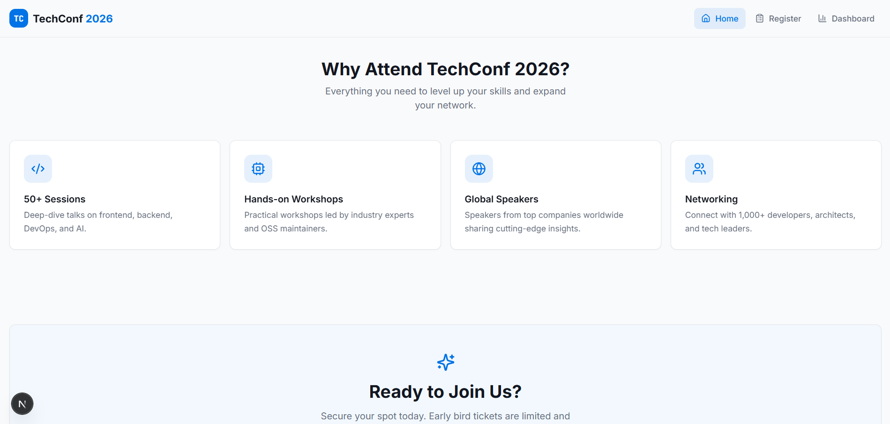
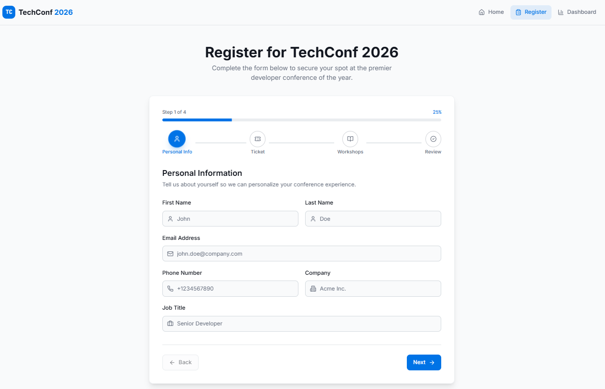
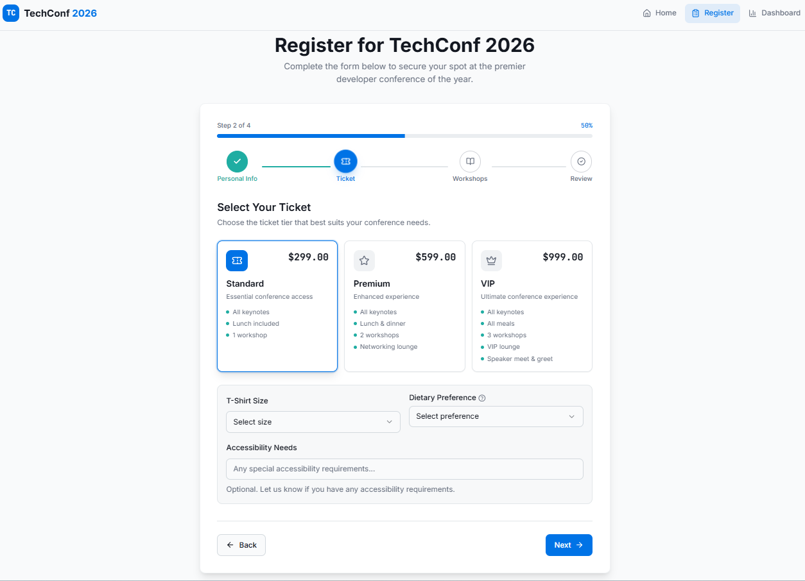
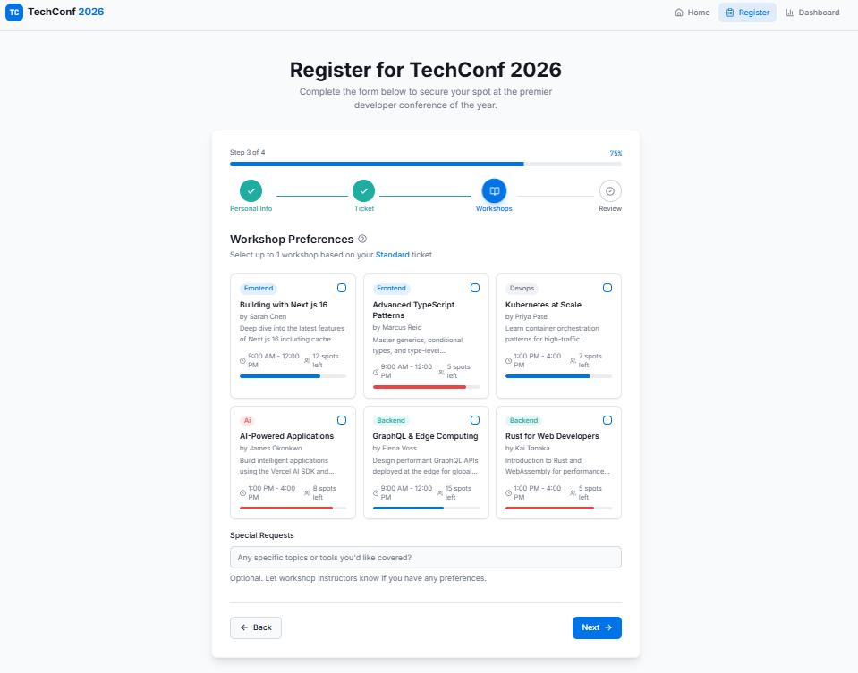
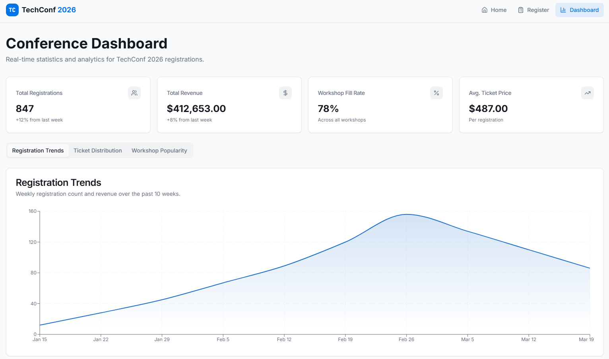

# TechConf

This site is a project for my Fullstack class. It's a simple conference website, statistics, and registration.

## Here are some previews:

### Landing Page

---

### Register Page

---

### Dashboard

## How to run locally?

Simply `npm install` and `npm run dev`
